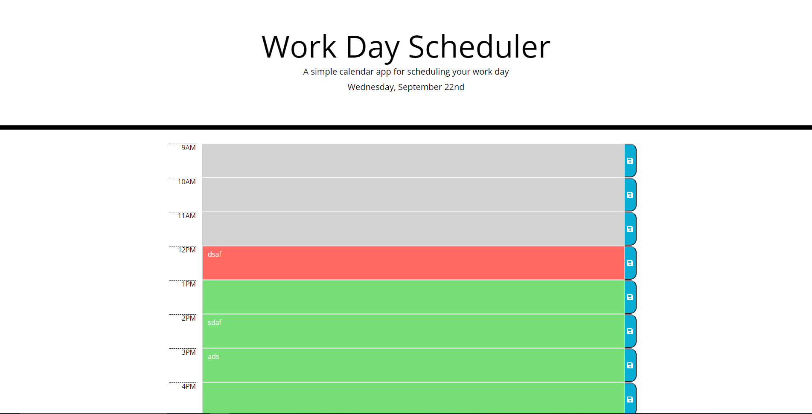

# 05-hw-day-planner
Work Day Planner

## Task ##

Create a simple calendar application that allows a user to save events for each hour of the day by modifying starter code. This app will run in the browser and feature dynamically updated HTML and CSS powered by jQuery.

## Acceptance Criteria

```md
GIVEN I am using a daily planner to create a schedule
WHEN I open the planner
THEN the current day is displayed at the top of the calendar
WHEN I scroll down
THEN I am presented with timeblocks for standard business hours
WHEN I view the timeblocks for that day
THEN each timeblock is color coded to indicate whether it is in the past, present, or future
WHEN I click into a timeblock
THEN I can enter an event
WHEN I click the save button for that timeblock
THEN the text for that event is saved in local storage
WHEN I refresh the page
THEN the saved events persist
```

- Template for HTML and CSS have been provided. Created folders to identify files.
- Created JS file for javascript.
- Created Variables for time blocks
- Created function that creates the task blocks that uses a for loop for maximum number created. Will append different styles for time blocks depending on current time.
- Created a storeTasks function to store tasks in local storage. 
-  Created store function that gets the local storage and also run createTimeBlocks function.
- created a document.ready function to initialise the document.
- Tested page and is working. Will save on reload.

## Demo ##



## Links ##

### REPO ###

### PAGES ###